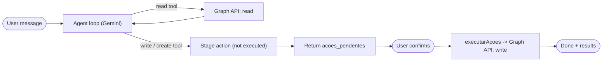
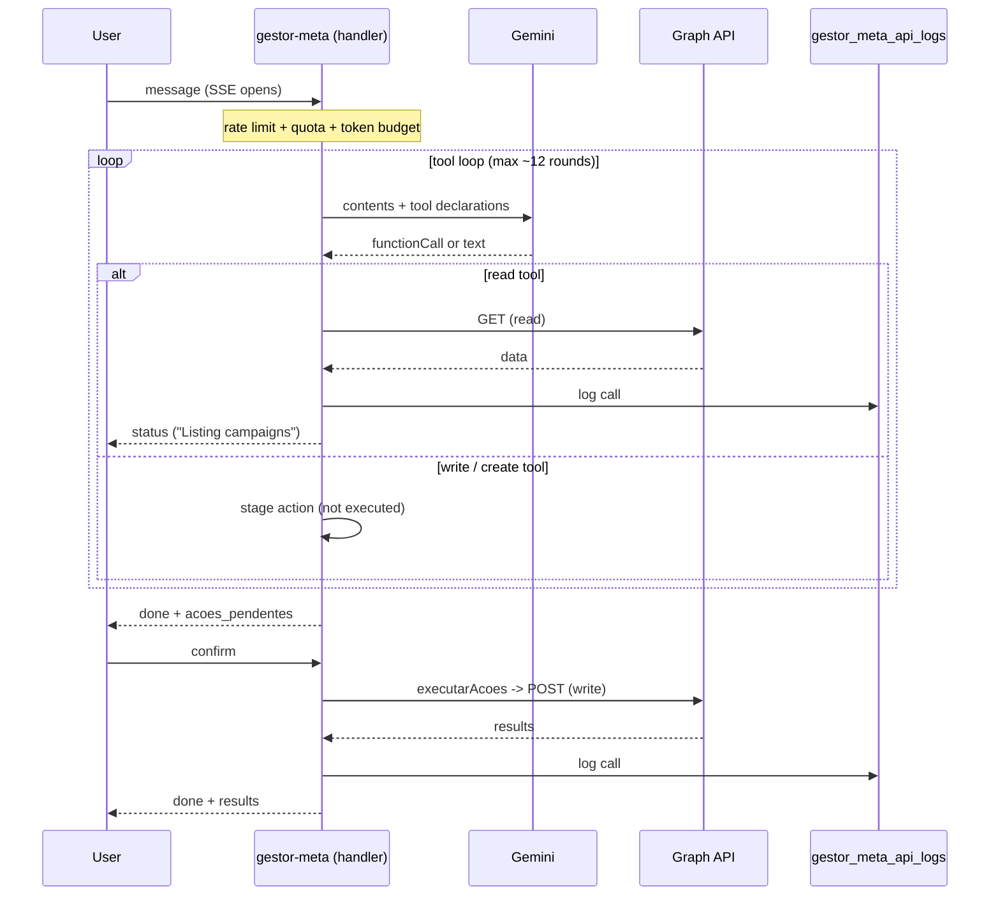
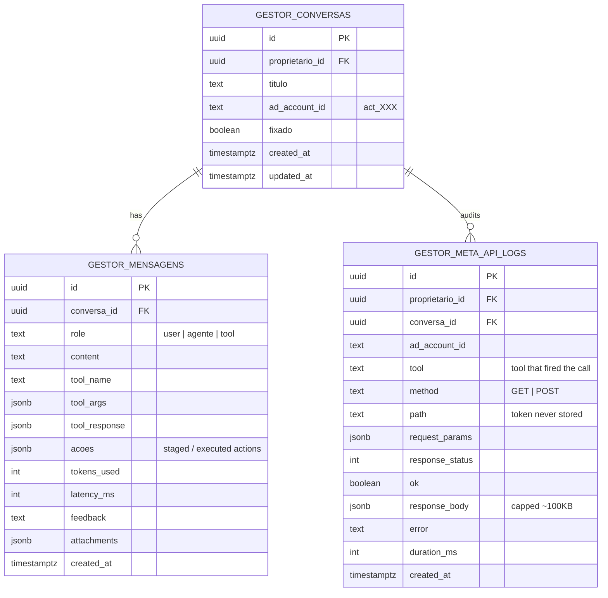

# AI agent that acts on Meta

The **Meta-account agent** is the centerpiece of Paidt. It isn't a chatbot that explains
ads — it operates the user's ad account directly through the Graph API: it reads
campaigns and metrics, proposes changes, and, once the user confirms, **executes** them
(pause/resume, budget changes, targeting edits, creating campaigns/ad sets/ads).

The hard part of an agent that *acts* isn't the prompting — it's doing it safely,
auditably, and without runaway cost. That's where the design effort went.

## Shape

- **Model:** Google Gemini (`gemini-3.5-flash`) with native function-calling.
- **Scope:** account-scoped. Token and active ad account are resolved per user from the
  Meta connection via a single shared resolver, so the agent always operates the same
  account the rest of the app shows.
- **Transport:** Server-Sent Events. Each tool call streams a real human-readable status
  ("Listing your campaigns") instead of a generic "Thinking…".
- **Tools:** grouped into **read** (campaigns, metrics, account overview, creative
  performance, delivery health, targeting detail, competitor data…), **write**
  (pause/resume, budget, rename, delete, targeting, swap creative, build audience), and
  **create** (full campaign, ad set, ad). Two terminal tools render UI: a multiple-choice
  question (chips) and a visual creative picker.

## The safety model: stage, then confirm

This is the core idea. Read tools run immediately — they're harmless. **Write and create
tools never touch Meta inside the agent loop.** Instead they *stage* an action:

The agent's turn ends with a list of **pending actions** described in plain language. The
user reviews and confirms; only then does a separate path (`executarAcoes`) apply them to
the live account. A human is always between the model and an irreversible change to real
ad spend.

### The turn, end to end

## Audit: every Graph call is logged

When a turn runs, Graph API logging is switched on. Every `GET`/`POST` the agent makes —
read or write — writes one row to `gestor_meta_api_logs`: the tool that triggered it,
method, path, request params, response status, a (size-capped) response body, error, and
duration. A few deliberate choices:

- **The access token is never logged.** It's appended only to the final URL/form, never
  to the `path` or `params` that get stored.
- **Logging is fire-and-forget** via `EdgeRuntime.waitUntil`, so it never slows the turn
  or breaks the Meta call if the insert fails.
- **Response bodies are capped** (~100 KB) so a giant insights payload can't blow up a row.

The result is a complete, queryable trail of everything the agent did on the account —
which is what makes an acting agent trustworthy in production.

## Data model

Three tables back the agent: the conversation, its messages (including tool calls and the
actions staged or executed in each turn), and the Graph API audit log.

## Bounded cost and abuse control

An agent that loops over tool calls can spiral in both cost and time, so the loop is
fenced in:

- **Loop cap:** the tool loop runs at most a fixed number of rounds, and after a
  threshold it *forces* a text answer (tools disabled) so a turn always terminates.
- **Rate limit:** a per-user window (e.g. 30 turns/60s) gates both chat turns and
  confirmations.
- **Spend quota:** a monthly USD quota per plan tier is checked before the paid loop runs.
- **Cost accounting:** every Gemini round records its token cost (see
  [the FinOps deep-dive](ai-finops.md)), correlated by conversation and loop iteration.

## Why this is the interesting part

Plenty of demos show an LLM "managing ads." Making it safe to run against a real account
is a different problem: the staging boundary keeps the model from doing damage, the audit
log makes every action accountable, and the loop/quota fences keep cost predictable. That
combination — not the prompt — is what makes it production-grade.