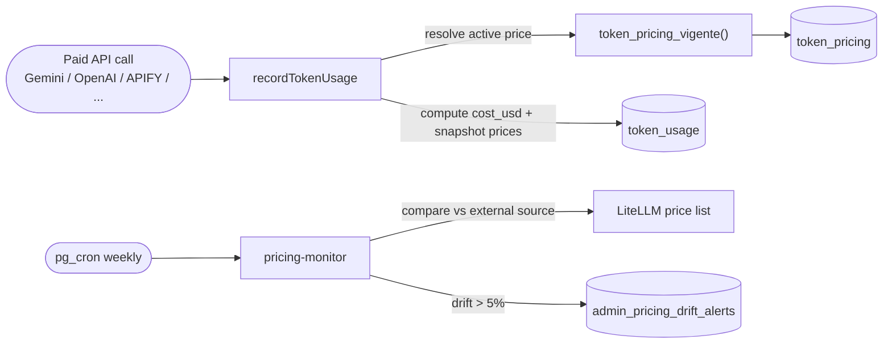
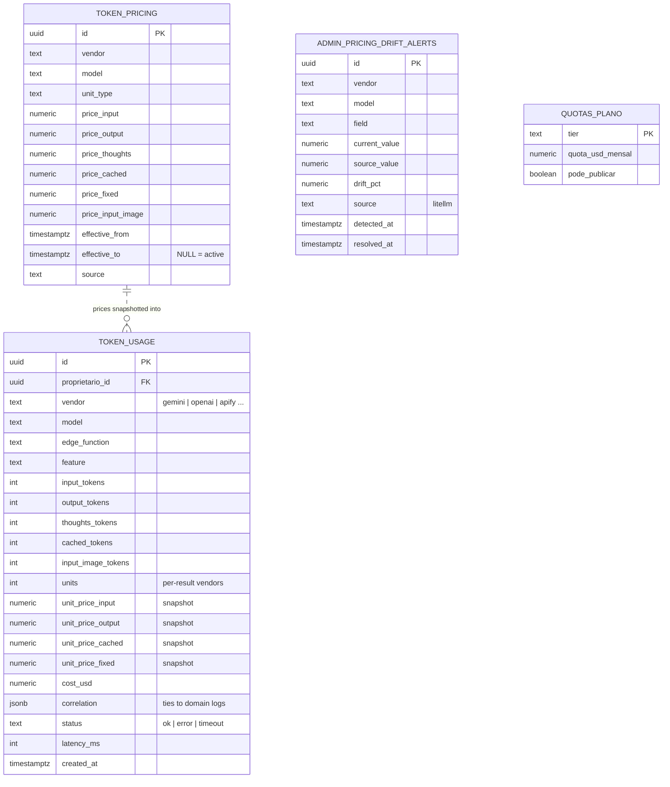

# AI cost observability (FinOps)

Paidt runs a lot of paid AI: Gemini for the agents and creative analysis, OpenAI for
image generation, Perplexity for search, plus APIFY and Microlink in the scraping
pipeline. Left unmeasured, that cost is invisible until the invoice arrives. This
subsystem makes the cost of every single external call **observable, attributable, and
auditable** — which is rare to see built into an LLM product.

## One row per paid call

A shared helper, `recordTokenUsage`, is called after every paid external request and
writes one row to `token_usage`. The row captures who triggered it (`proprietario_id`),
the vendor and model, the edge function and feature, the raw metrics
(input / output / thoughts / cached / image tokens, or `units` for per-result vendors),
the latency, a status, and — crucially — `cost_usd` **plus the unit prices used to
compute it**.

Snapshotting the prices onto the row (not just the cost) means a later price change never
rewrites history: every row stays explainable forever.



## Getting the cost math right

The cost calculation handles the details that are easy to get wrong:

- **Cached tokens are a subset of input.** Gemini reports `inputTokens` as the whole
  prompt and `cachedTokens` as the part served from cache at a reduced rate. Billing the
  full input *and* the cached portion would double-charge, so the plain input is
  `max(0, input − cached − image)` and each bucket is priced separately.
- **Image input can cost more than text.** When a vendor charges a separate image rate,
  those tokens are split out of the input and priced with `price_input_image`.
- **Vendors charge on errors too.** Gemini still bills prompt tokens on a 500, so callers
  record `status='error'` with the tokens consumed rather than dropping the cost.
- **Per-result vendors** (APIFY actors, per-image generators) use `units` × a fixed price
  instead of token math.

## Versioned prices, never a silent gap

`token_pricing` is **versioned**: a price has an `effective_from`/`effective_to`, and the
active row for a (vendor, model) is the one where `effective_to IS NULL`. The
`token_pricing_vigente()` RPC resolves it.

If a price is missing — a vendor ships a new model before the table is updated — the
helper doesn't fail or guess. It records `cost_usd = 0` and flags the row with
`correlation.pricing_missing = true`. Production never blocks, and the gaps are one query
away:

```sql
SELECT vendor, model, COUNT(*)
FROM token_usage
WHERE correlation->>'pricing_missing' = 'true'
GROUP BY 1, 2;
```

The whole helper is **best-effort**: a telemetry write never takes down the request it's
measuring. The user's answer matters more than the metric.

## Data model

`token_usage` is the ledger (one row per call, with prices snapshotted); `token_pricing`
holds the versioned price list it reads from; `admin_pricing_drift_alerts` collects what
the monitor flags; `quotas_plano` defines the per-tier spend cap the agent checks.



## Catching price drift

Manually-maintained prices go stale. A weekly `pricing-monitor` job (triggered by
`pg_cron` via `pg_net`, authenticated with a shared secret since cron has no JWT) pulls a
community price list (LiteLLM), compares it field-by-field against the active
`token_pricing` rows, and records any divergence over 5% into
`admin_pricing_drift_alerts`. It **alerts, it doesn't auto-update** — a human decides
whether the external source or the local price is right. Vendors with no external
coverage (APIFY, Microlink) are skipped rather than falsely flagged.

## Tying cost back to features

Every row carries a `correlation` JSON blob linking the cost to the domain action that
caused it — a conversation and loop iteration for the agent, a report id for a generation,
and so on. New surfaces add keys without a migration. That makes questions like "what does
one agent turn actually cost?" or "which feature is the most expensive per user?"
answerable directly from `token_usage`.

## Why this matters

Most teams discover LLM cost from the monthly bill and a spreadsheet. Building cost
observability *into* the product — per call, attributable to a user and a feature, with
snapshotted prices and drift detection — is the kind of operational maturity that usually
only shows up after a painful surprise. Here it was designed in from the start.